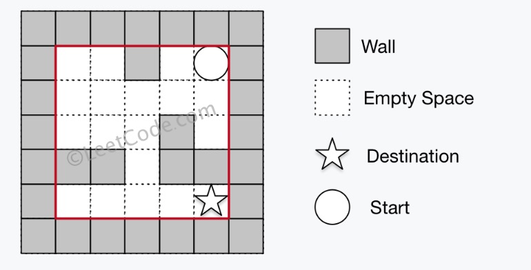
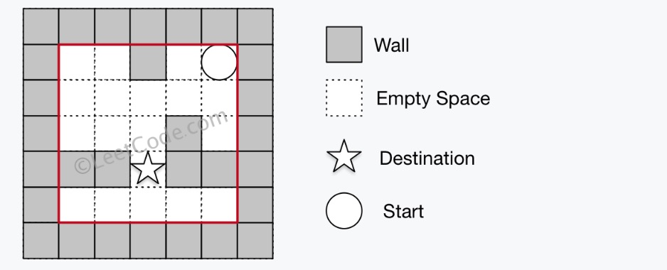

# The Maze



There is a **ball** in a maze with empty spaces and walls. The ball can go through empty spaces by rolling **up**, **down**, **left** or **right**, but it won't stop rolling until hitting a wall. When the ball stops, it could choose the next direction.

Given the ball's **start position**, the **destination** and the **maze**, determine whether the ball could stop at the destination.

The maze is represented by a binary 2D array. 1 means the wall and 0 means the empty space. You may assume that the borders of the maze are all walls. The start and destination coordinates are represented by row and column indexes.

**Example 1:**

```
Input 1: a maze represented by a 2D array

0 0 1 0 0
0 0 0 0 0
0 0 0 1 0
1 1 0 1 1
0 0 0 0 0

Input 2: start coordinate (rowStart, colStart) = (0, 4)
Input 3: destination coordinate (rowDest, colDest) = (4, 4)

Output: true

Explanation: One possible way is : left -> down -> left -> down -> right -> down -> right.

```



**Example 2:**

```
Input 1: a maze represented by a 2D array

0 0 1 0 0
0 0 0 0 0
0 0 0 1 0
1 1 0 1 1
0 0 0 0 0

Input 2: start coordinate (rowStart, colStart) = (0, 4)
Input 3: destination coordinate (rowDest, colDest) = (3, 2)

Output: false

Explanation: There is no way for the ball to stop at the destination.

```

**Note:**

1. There is only one ball and one destination in the maze.
2. Both the ball and the destination exist on an empty space, and they will not be at the same position initially.
3. The given maze does not contain border (like the red rectangle in the example pictures), but you could assume the border of the maze are all walls.
4. The maze contains at least 2 empty spaces, and both the width and height of the maze won't exceed 100. &#x20;



#### BFS Approach

```java
//DFS approach
class Solution {
    public boolean hasPath(int[][] maze, int[] start, int[] destination) {
        
        boolean[][] visited = new boolean[maze.length][maze[0].length];
        
        int[] rdir = new int[]{0, 1, 0, -1};
        int[] cdir = new int[]{1, 0, -1, 0};
        
        Deque<int[]> queue = new LinkedList<>();
        queue.addFirst(start);
        visited[start[0]][start[1]] = true;
        
        while (!queue.isEmpty()) {
            int[] ball = queue.removeLast();
            for (int i = 0; i < 4; ++i) {
                int[] newBall = new int[]{ball[0], ball[1]};
                int m = ball[0];
                int n = ball[1];
                while (true) {
                    m = m + rdir[i];
                    n = n + cdir[i];
                    //if (newBall[0] == destination[0] && newBall[1] == destination[1]) return true;
                    if (!isValid(new int[] {m, n}, maze)) break;
                    newBall[0] = m;
                    newBall[1] = n;
                }
                if (newBall[0] == destination[0] && newBall[1] == destination[1]) return true;
                if (visited[newBall[0]][newBall[1]] == false) {
                    queue.addFirst(newBall);
                    visited[newBall[0]][newBall[1]] = true;
                }
            }
        }
        return false;
    }
    private boolean isValid(int[] coord, int[][] maze) {
        int r = coord[0];
        int c = coord[1];
        if (r < 0 || r >= maze.length || c < 0 || c >= maze[0].length) return false;
        if (maze[r][c] == 1) return false;
        return true;
    }
}
```

#### DFS Approach

```java
class Solution {
    private boolean reached;
    public boolean hasPath(int[][] maze, int[] start, int[] destination) {
        boolean[][] visited = new boolean[maze.length][maze[0].length];
        int[] rdir = new int[]{0, 1, 0, -1};
        int[] cdir = new int[]{1, 0, -1, 0};
        dfs(maze, start, destination, visited, rdir, cdir);
        
        return reached;
    }
    private void dfs(int[][] maze,
                    int[] cur,
                    int[] destination,
                    boolean[][] visited,
                    int[] rdir,
                    int[] cdir) {
        if (cur[0] == destination[0] && cur[1] == destination[1]) {
            reached = true;
            return;
        }
        
        if (visited[cur[0]][cur[1]]) {
            return;
        }
        
        visited[cur[0]][cur[1]] = true;
        for (int i = 0; i < 4; ++i) {
            int m = cur[0], n = cur[1];
            while (isValid(m + rdir[i], n + cdir[i], maze)) {
                m = m + rdir[i];
                n = n + cdir[i];
            }
            
            dfs(maze, new int[]{m, n}, destination, visited, rdir, cdir);
        }
    }
    private boolean isValid(int m, int n, int[][] maze) {
        if (m < 0 || m >= maze.length || n < 0 || n >= maze[0].length) {
            return false;
        }
        
        if (maze[m][n] == 1) {
            return false;
        }
        
        return true;
    }
}
```
